<div align="center">

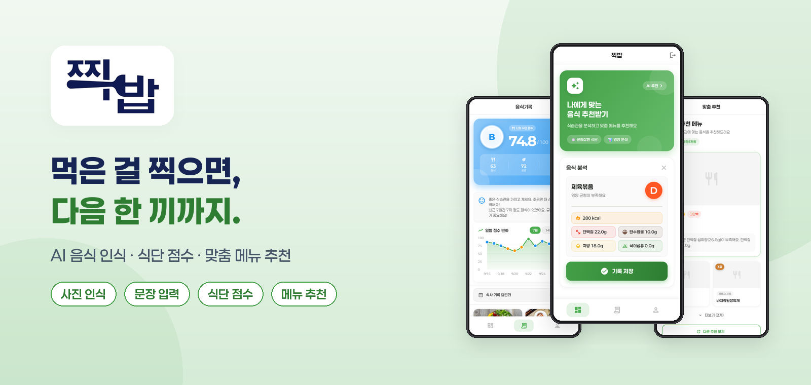

# 찍밥 · JjikBap

**"밥 먹은 것을 찍다"** — 사진 한 장, 문장 한 줄로 끝나는 AI 식단 기록 앱

<p>
  
  
  
  
  
  
  
</p>

<sub>2025 실험실 특화 창업 (RISE 사업) · 2025.09 – 2025.12</sub>

[소개](#-소개) · [미리보기](#-미리보기) · [AI 파이프라인](#-ai-파이프라인) · [기술 스택](#-기술-스택) · [실행 방법](#-실행-방법) · [트러블슈팅](#-트러블슈팅)

</div>

<br>

## 📌 소개

식단 앱은 많지만, **매 끼니 음식을 검색해서 입력하는 과정이 번거로워** 금방 기록을 포기하게 됩니다.
찍밥은 그 입력 부담을 없애는 데서 출발했습니다.

| | |
|:---:|---|
| 📷 **입력은 한 번에** | 사진 한 장 또는 "점심에 제육볶음 먹었어" 한 문장이면 음식 인식부터 영양 계산까지 자동 |
| 📊 **기록이 점수로** | 쌓인 기록으로 식단 점수(A~F)와 결식·편식·야식 피드백 제공 |
| 🍽 **점수가 추천으로** | 부족한 영양소와 최근 식습관을 분석해 "다음에 뭐 먹지?"에 이유와 함께 답함 |

<details>
<summary><b>유사 서비스 조사</b></summary>
<br>

| 서비스 | 특징 | 찍밥과의 차이 |
|---|---|---|
| Plan to Eat | 메뉴 룰렛, 주변 식당, 예산 관리 (구독 주 4,400원) | 식단·영양 기록이 없음 |
| 망고플레이트 · 식신 · 캐치테이블 | 지역·카테고리 기반 맛집 추천 | 개인 식습관·영양을 고려하지 않음 |
| 일반 식단 기록 앱 | 음식 검색 후 수동 입력 | 사진·문장 자동 인식 + 개인화 추천 |

수익 모델로는 광고, 구독 요금제, 식당 예약 연동 수수료를 검토했습니다.
</details>

<br>

## 👥 팀

<table>
  <tr>
    <th width="120">역할</th>
    <th>담당 업무</th>
  </tr>
  <tr>
    <td align="center"><b>김민성</b><br><sub>Full-stack · ML</sub></td>
    <td>Flutter 앱 전 화면 구현 · FastAPI 서버와 REST API(49개) 설계·구현 · SQLite DB 설계 · 음식 분류 모델 학습 · 모델/NER/임베딩 추천 서버 연동</td>
  </tr>
  <tr>
    <td align="center"><b>팀원</b><br><sub>ML</sub></td>
    <td>음식 인식 모델 조사·선정 · 모델 학습</td>
  </tr>
  <tr>
    <td align="center"><b>지도교수</b></td>
    <td>기획 방향 및 개선사항 피드백</td>
  </tr>
</table>

<br>

## 📱 미리보기

<table>
  <tr>
    <td align="center" width="25%"><b>① 로그인</b><br><sub>ID·비밀번호 / Google 계정</sub></td>
    <td align="center" width="25%"><b>② 문장으로 기록</b><br><sub>문장에서 음식 후보를 확률과 함께 추출</sub></td>
    <td align="center" width="25%"><b>③ 영양 분석</b><br><sub>칼로리·탄단지 자동 입력, 끼니 등급</sub></td>
    <td align="center" width="25%"><b>④ 음식 평가</b><br><sub>별점이 선호도로 쌓여 추천에 반영</sub></td>
  </tr>
  <tr>
    <td>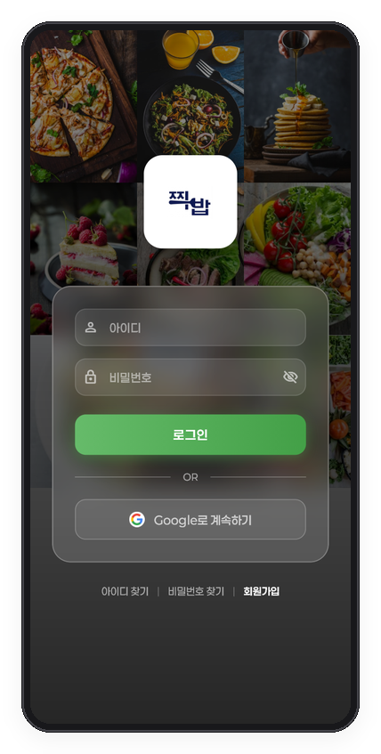</td>
    <td>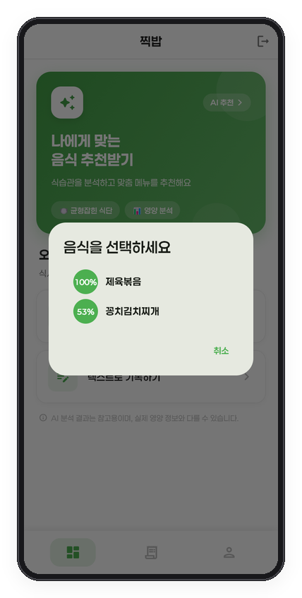</td>
    <td>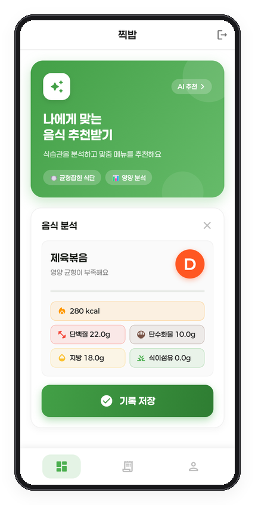</td>
    <td>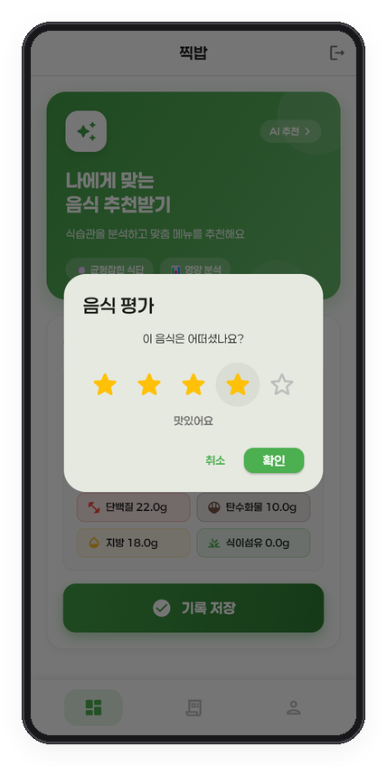</td>
  </tr>
  <tr>
    <td align="center"><b>⑤ 식단 점수</b><br><sub>음식·영양·습관 점수와 일별 추이</sub></td>
    <td align="center"><b>⑥ 기록 갤러리</b><br><sub>사진·끼니·칼로리 한눈에, 캘린더 조회</sub></td>
    <td align="center"><b>⑦ 가격대 설정</b><br><sub>예산에 맞는 메뉴만 추천</sub></td>
    <td align="center"><b>⑧ 맞춤 추천</b><br><sub>부족 영양소 기반 순위와 추천 이유</sub></td>
  </tr>
  <tr>
    <td>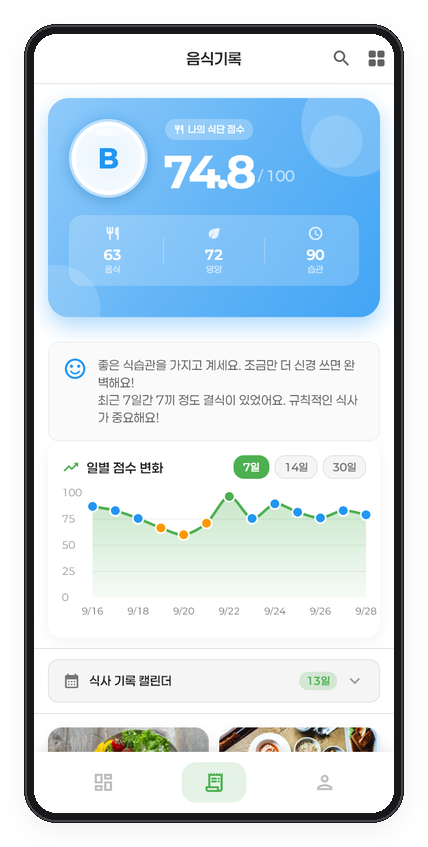</td>
    <td>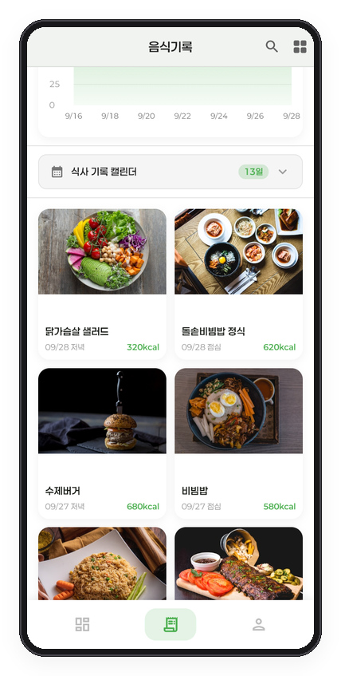</td>
    <td>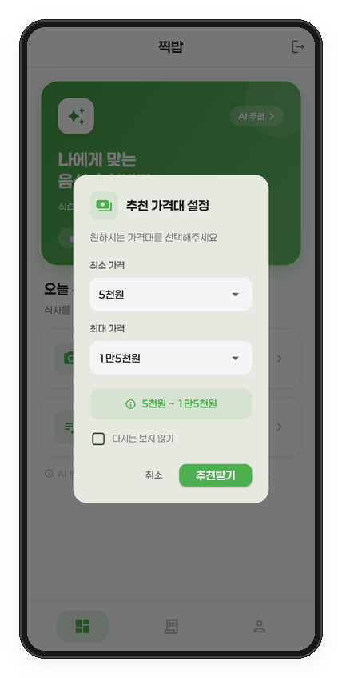</td>
    <td>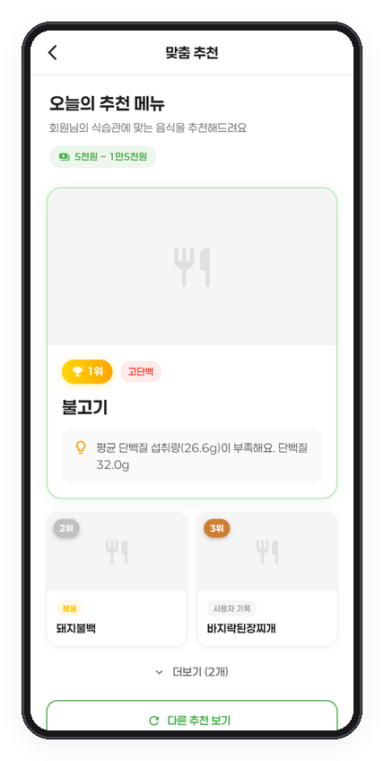</td>
  </tr>
</table>

그 밖에 **사진 인식**(촬영·갤러리), 일일 **목표·D-Day**, 사진 EXIF 위치 저장, **주변 음식점 검색**(지도), 음식 **커뮤니티**, 식사 시간 **알림**(Android)을 지원합니다.

<br>

## 🧠 AI 파이프라인

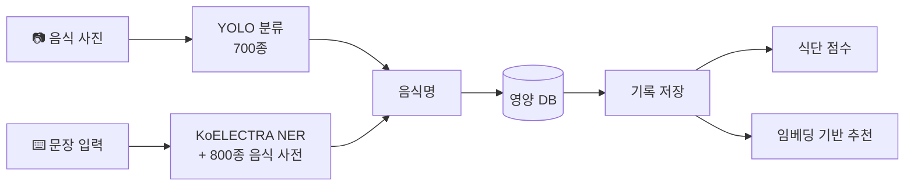

| 단계 | 방법 |
|---|---|
| **이미지 분류** | AI Hub 한국 음식 이미지로 학습한 YOLO 분류 모델(700종). 실패 시 14종 Detection 모델로 보조 인식 |
| **문장 → 음식명** | 분류 모델과 같은 라벨 체계의 800종 음식 사전 + KoELECTRA로 문장에서 음식명 추출 |
| **영양 매핑** | 인식된 음식명으로 영양 DB 조회 (실측값이 있는 SQLite DB 우선) |
| **메뉴 추천** | 이미지·텍스트·영양소를 합친 음식 임베딩의 코사인 유사도 + 사용자 식사 이력 |
| **식단 점수** | `0.3 × 음식 선호(별점) + 0.4 × 영양 비율 + 0.3 × 식습관` |

<details>
<summary><b>추천 · 점수 알고리즘 자세히</b></summary>
<br>

**임베딩 추천**
- 최근 7일 식사 기록을 요일 가중치로 평균 내 **사용자 임베딩** 생성
- 쿼리 = 예측 음식 `0.8` + 사용자 임베딩 `0.2`
- 유사도가 임계값(`0.5`) 이상인 음식은 제외해 **다양성** 확보, 최근 3일 음식과 겹치지 않는지 확인해 추천 이유 생성

**식단 점수**
- 영양 비율: 탄 50 / 단 20 / 지 30에 가까울수록 높음
- 식습관: 결식(하루 3끼 기준), 같은 음식 4회 이상 반복, 22시 이후 야식에 감점
- 등급: A(80↑) · B(65↑) · C(50↑) · D(30↑) · F
</details>

<details>
<summary><b>모델 개발 과정</b></summary>
<br>

| 시기 | 내용 |
|---|---|
| 9월 1주 | 모델 조사 — AI Hub 한국 음식 이미지 / Recipe1M+, YOLOv8 vs ResNet, 텍스트는 BERT 계열 검토 |
| 9월 2주 | **베이스라인**: AI Hub 샘플 14종(클래스당 학습 230장), YOLOv8n 분류, 224px·20 epoch → **Top-1 60% / Top-5 87%** |
| 9월 3주 | 예측 음식명 → 영양성분 매핑, Top-k 후보를 사용자에게 보여주는 방식 설계 |
| 10월 1주 | **음식 양(g) 추정** 실험 — AI Hub 3D 바운딩박스로 부피를 구해 무게 회귀, 5-Fold 교차검증(MAE·MAPE). 오차가 커서 앱에는 미반영 |
| 10월 ~ 11월 | **700종**으로 확장한 분류 모델, KoELECTRA 텍스트 인식, 임베딩 추천 서버 연동 |
| 11월 ~ 12월 | APK 배포 → 피드백 반영(Google 로그인 등) → 사용 안내서 제작 |
</details>

<br>

## 🛠 기술 스택

| 영역 | 기술 |
|---|---|
| **App** | Flutter · Dart · provider · fl_chart · table_calendar · sqflite · image_picker · exif · webview_flutter · flutter_local_notifications · google_sign_in |
| **Backend** | FastAPI · SQLAlchemy · SQLite · Pydantic v2 · Uvicorn |
| **AI** | Ultralytics YOLO · KoELECTRA (`monologg/koelectra-small-v3-discriminator`) · NumPy 임베딩 추천 |
| **Collaboration** | 주간 회의 17회(회의록·활동계획서) · Figma 화면 기획 · ChatGPT · Claude Code · Colab |

<details>
<summary><b>시스템 구조 · 폴더 구성</b></summary>
<br>

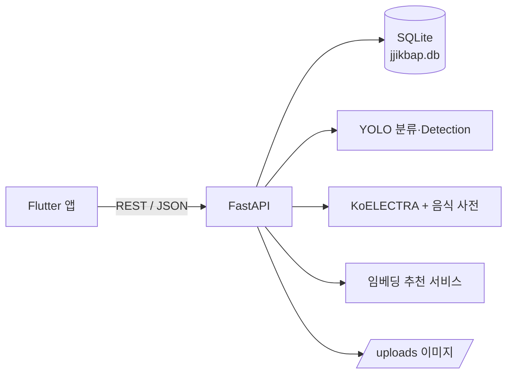

```
jjikbap/
├── backend/
│   ├── app/
│   │   ├── api/routes.py          # REST 엔드포인트 (49개)
│   │   ├── services/              # 음식 분석 · NER 음식 인식 · 추천·점수
│   │   ├── models/ · schemas/     # SQLAlchemy 모델 · Pydantic 스키마
│   │   ├── ml_models/             # YOLO 가중치, 라벨, 영양·가격·임베딩 데이터
│   │   └── main.py
│   ├── scripts/                   # 데이터 생성·검증·마이그레이션 스크립트
│   └── sample_data/               # 시드용 샘플 음식 사진
├── frontend/
│   └── lib/
│       ├── screens/               # 대시보드 · 기록 · 추천 · 마이페이지 등
│       ├── services/              # API · 로컬 DB · 알림 · Google 로그인
│       ├── models/
│       └── config/api_config.dart # 빌드 모드별 서버 주소
└── docs/
```
</details>

<br>

## 🚀 실행 방법

```bash
# 1) 백엔드 — food_classifier.pt는 Releases에서 받아 backend/app/ml_models/ 에 넣기
cd backend
pip install -r requirements.txt
uvicorn app.main:app --host 0.0.0.0 --port 8000

# 2) 앱
cd frontend
flutter pub get
flutter run -d windows
```

- 샘플 데이터: `python scripts/seed_sample_data.py` (backend 폴더에서, 데모 계정과 2주치 기록 생성)
- API 문서: 서버 실행 후 http://localhost:8000/docs
- 에뮬레이터·실기기 연결, APK 빌드, 스크립트 목록은 **[docs/SETUP.md](docs/SETUP.md)** 참고

<br>

## 🔧 트러블슈팅

<details>
<summary><b>모든 음식의 영양 정보가 300kcal로 똑같이 나오던 문제</b></summary>
<br>

- **원인**: 700종 분류 모델로 확장하면서 영양 정보가 없는 음식에 기본값(300kcal/탄40/단15/지10)을 일괄로 채움 → 인식은 정확해도 수치가 모두 같음. 실측값이 있는 SQLite 영양 DB는 분석 로직에서 참조하지 않고 있었음
- **해결**: 분석 시 SQLite 영양 DB의 실측값을 우선 사용하고, 입력한 음식명이 DB에 정확히 있으면 사전 매칭보다 우선 적용 (`김치찌개` → `꽁치김치찌개`로 잘못 바뀌던 문제도 함께 해결)
</details>

<details>
<summary><b>기록을 저장해도 기록 탭에 안 보이던 문제</b></summary>
<br>

- **원인**: 하단 탭을 `IndexedStack`으로 유지해서 기록 화면이 `initState`에서 한 번만 데이터를 불러옴. 갱신 수단이 당겨서 새로고침뿐이라 데스크톱(마우스)에서는 새 기록이 반영되지 않음
- **해결**: 탭 진입 시 해당 화면의 `Key`를 새로 발급해 화면을 다시 만들고 최신 기록을 조회하도록 변경
</details>

<details>
<summary><b>좁은 화면에서 대시보드 레이아웃이 넘치던 문제</b></summary>
<br>

- **원인**: 추천 카드의 기능 칩을 고정 폭 `Row`로 배치해 화면 폭이 좁으면 `RenderFlex overflow` 발생
- **해결**: `Wrap`으로 바꿔 공간이 부족하면 다음 줄로 넘어가도록 변경
</details>

<details>
<summary><b>Windows 빌드 실패 (<code>ShaderCompilerException</code>)</b></summary>
<br>

- **원인**: 사용자 폴더명(한글)이 포함된 경로를 Flutter 셰이더 컴파일러가 잘못 해석
- **해결**: 영문 경로에서 빌드. 네이티브 러너 소스(`main.cpp`)의 창 제목도 `\x` 이스케이프로 작성해 MSVC 인코딩 문제 회피
</details>

<br>

## 📈 한계와 개선 과제

- [ ] **영양 데이터** — 분류 모델 700종 중 실측 영양 정보가 있는 음식은 일부 → 식품의약품안전처 식품영양성분 DB 연동, 100g/1인분 기준 정규화
- [ ] **인식 정확도** — 음식 양(g) 추정 모델은 오차가 커서 보류 → 데이터 보강 후 재시도
- [ ] **식단 점수** — 영양 비율 계산에서 탄수화물 대신 칼로리 합계를 사용하는 버그 수정
- [ ] **보안** — 비밀번호 해시(bcrypt)·비밀번호 규칙·토큰 인증, 배포 서버 HTTPS 적용
- [ ] **맛집 연동** — 대전광역시 음식점 정보 오픈 API로 추천 메뉴 → 실제 판매 식당 연결
