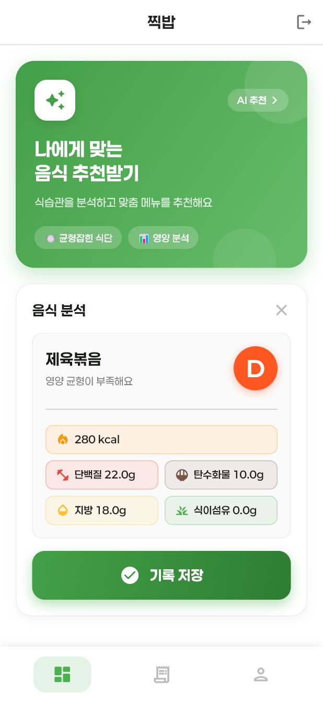
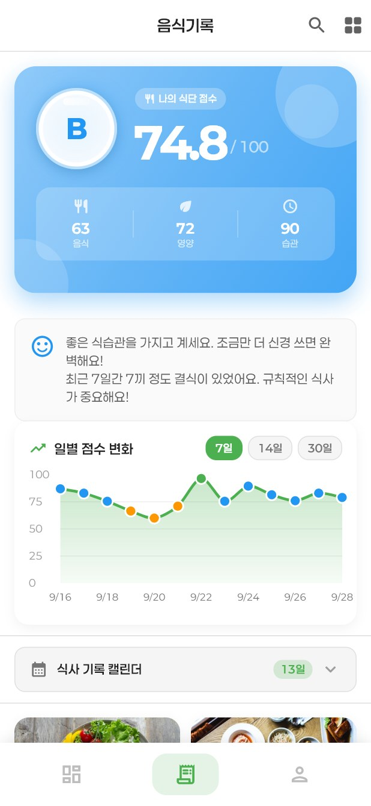
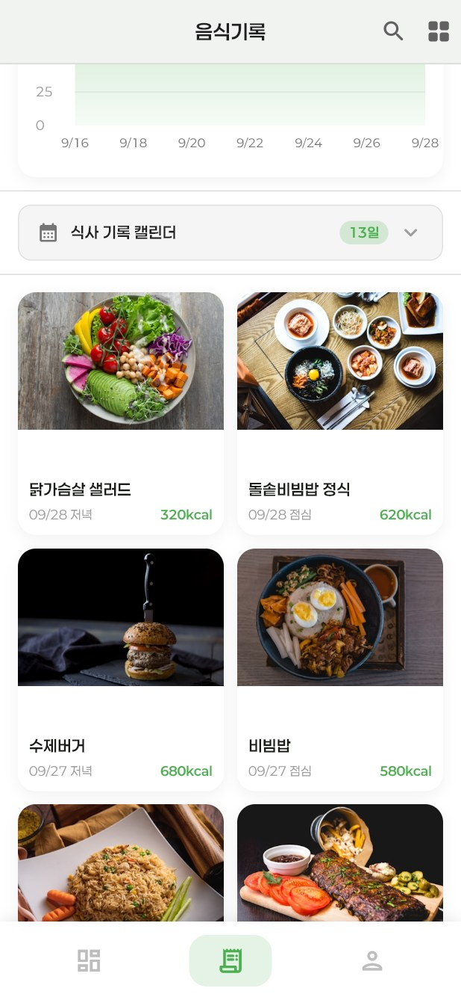
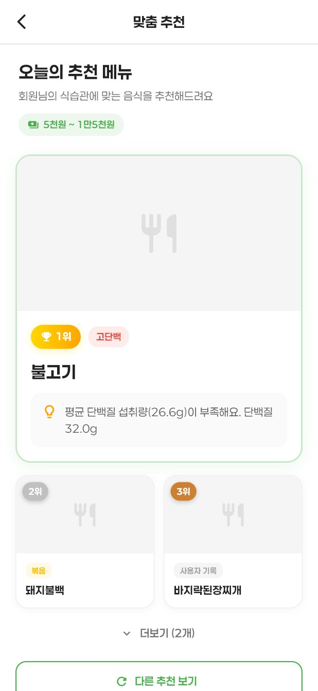
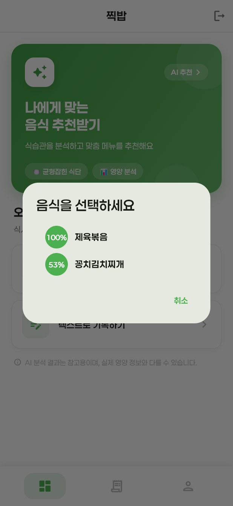
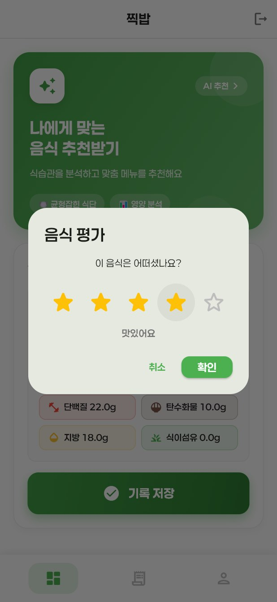
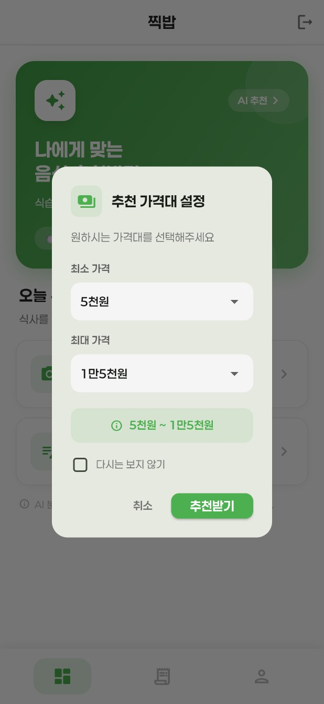
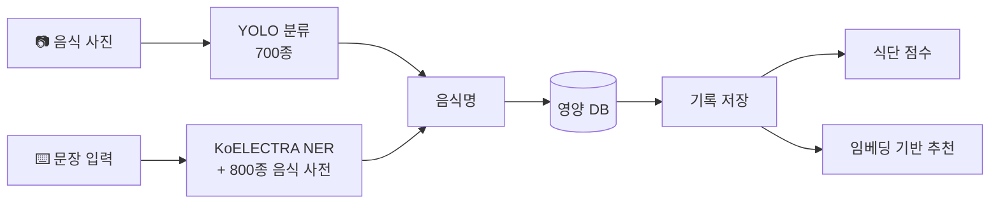
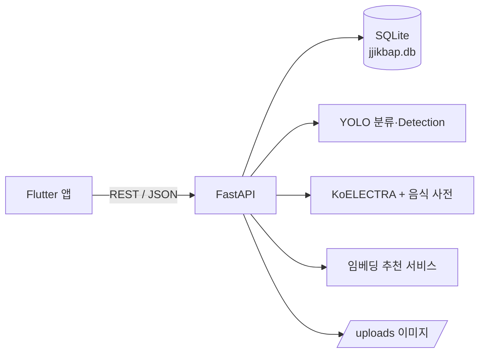

# 찍밥 (JjikBap)

> **"밥 먹은 것을 찍다"** — 사진 한 장으로 끝나는 식단 기록, AI가 골라주는 다음 한 끼

음식 사진을 찍거나 "제육이랑 김치찌개 먹었어"처럼 문장으로 입력하면
AI가 음식을 인식해 칼로리·탄단지를 기록하고, 식단 점수와 함께 다음 메뉴를 추천하는 식단 관리 앱입니다.

<p align="center">
  
  
  
  
</p>

| 항목 | 내용 |
|---|---|
| 과제 | 2025 실험실 특화 창업 (RISE 사업) |
| 기간 | 2025.09 ~ 2025.12 (주 1회 정기 회의 17회) |
| 팀 | 식단관리팀 · 팀원 2명 + 지도교수 |
| 담당 | **프론트엔드(Flutter) · 백엔드(FastAPI) 전체 개발, 모델 학습 및 서버 연동** |
| 플랫폼 | Android · Windows (Flutter) / FastAPI 서버 |

### 역할 분담

| 담당 | 업무 |
|---|---|
| **본인** | Flutter 앱 전 화면 구현 · FastAPI 서버와 REST API(49개) 설계·구현 · SQLite DB 설계 · 음식 분류 모델 학습 · 모델/NER/임베딩 추천을 서버에 연동 |
| 팀원 | 음식 인식 모델 조사·선정 · 모델 학습 |
| 지도교수 | 기획 방향 및 개선사항 피드백 |

---

## 기획 배경

식단 앱은 많지만 **매 끼니 음식을 검색해서 입력하는 과정이 번거로워** 금방 기록을 포기하게 됩니다.
찍밥은 입력 부담을 없애는 데서 출발했습니다.

- **입력은 한 번에** — 사진 한 장 또는 자연어 한 문장이면 음식 인식부터 영양 계산까지 자동
- **기록이 추천으로** — 쌓인 기록과 별점으로 식습관을 분석해 "다음에 뭐 먹지?"에 답함
- **먹는 곳까지** — 추천 메뉴를 파는 주변 음식점 검색으로 연결

### 유사 서비스 조사

| 서비스 | 특징 | 찍밥과의 차이 |
|---|---|---|
| Plan to Eat | 메뉴 룰렛, 주변 식당, 예산 관리 (구독 주 4,400원) | 식단/영양 기록이 없음 |
| 망고플레이트 · 식신 · 캐치테이블 | 지역·카테고리 기반 맛집 추천 | 개인 식습관·영양을 고려하지 않음 |
| 일반 식단 기록 앱 | 음식 검색 후 수동 입력 | 사진/문장 자동 인식 + 개인화 추천 |

수익 모델로는 광고, 구독 요금제, 식당 예약 연동 수수료를 검토했습니다.

## 주요 기능

| 기능 | 설명 |
|---|---|
| **음식 인식** | 📷 사진 촬영·갤러리 / ⌨️ 텍스트 입력 → AI가 음식명과 영양 정보를 자동으로 채움. 여러 후보가 나오면 확률과 함께 선택지 제공 |
| **식단 기록** | 사진, 별점, 식사 시간대, 사진 EXIF의 GPS 위치까지 저장 / 캘린더·갤러리·목록(날짜·칼로리·영양소 정렬) 조회 |
| **식단 점수** | 기간별(7/14/30일) 점수와 A~F 등급, 결식·편식·야식 피드백 |
| **맞춤 추천** | 내 평균 섭취량 분석 → 고단백/균형식 등 카테고리별 메뉴와 **추천 이유** 제시, 최근 먹은 음식과 겹치지 않게 다양성 보장, 가격대 필터·제외 음식 설정 |
| **목표 관리** | 일일 칼로리·탄단지·식이섬유 목표와 D-Day, 대시보드에 달성률 표시 |
| **주변 음식점** | 추천 메뉴를 파는 주변 식당을 지도(WebView)에서 검색 |
| **커뮤니티** | 음식 사진 게시글 작성·조회 |
| **계정·알림** | 회원가입/로그인, Google 로그인, 식사 시간 알림(Android) |

## 화면

| 로그인 | 문장으로 입력 → 음식 후보 | 영양 분석 결과 | 음식 평가 |
|:---:|:---:|:---:|:---:|
|  |  |  |  |
| **식단 점수 · 일별 추이** | **기록 갤러리** | **추천 가격대 설정** | **맞춤 추천 (추천 이유)** |
|  |  |  |  |

> "점심에 제육볶음 먹었어" 입력 → 음식 후보(확률) 선택 → 영양 정보 자동 입력 → 별점 평가 후 저장 → 기록·점수·추천에 반영

## AI 파이프라인



1. **이미지 분류** — AI Hub 한국 음식 이미지로 학습한 YOLO 분류 모델(700종). 분류가 실패하면 14종 Detection 모델로 보조 인식
2. **텍스트 음식명 추출** — 분류 모델과 같은 라벨 체계를 쓰는 800종 음식 사전 + KoELECTRA로 문장에서 음식명을 찾아냄
3. **영양 정보 매핑** — 인식된 음식명으로 영양 DB를 조회 (실측값이 있는 SQLite DB 우선)
4. **임베딩 추천** — 음식마다 이미지·텍스트·영양소 정보를 합친 임베딩을 만들고 코사인 유사도로 추천
   - 최근 7일 식사 기록을 요일 가중치로 평균 내 **사용자 임베딩** 생성
   - 쿼리 = 예측 음식 0.8 + 사용자 임베딩 0.2
   - 유사도가 임계값(0.5) 이상인 음식은 제외해 **다양성** 확보, 최근 3일 음식과 겹치지 않는지 확인해 추천 이유 생성
5. **식단 점수** — `0.3 × 음식 선호(별점) + 0.4 × 영양 비율 점수 + 0.3 × 습관 점수`
   - 영양 비율: 탄 50 / 단 20 / 지 30 에 가까울수록 높음
   - 습관: 결식(하루 3끼 기준), 같은 음식 4회 이상 반복, 22시 이후 야식에 감점

### 모델 개발 과정

| 시기 | 내용 |
|---|---|
| 9월 1주 | 모델 조사 — AI Hub 한국 음식 이미지 / Recipe1M+ 데이터, YOLOv8 vs ResNet, 텍스트는 BERT 계열 검토 |
| 9월 2주 | **베이스라인**: AI Hub 샘플 14종(클래스당 학습 230장), YOLOv8n 분류, 224px·20 epoch → **Top-1 60% / Top-5 87%** |
| 9월 3주 | 예측 음식명 → 영양성분 매핑, Top-k 후보를 사용자에게 보여주는 방식 설계 |
| 10월 1주 | **음식 양(g) 추정** 실험 — AI Hub 3D 바운딩박스로 부피를 구해 무게 회귀, 5-Fold 교차검증(MAE·MAPE). 오차가 커서 앱에는 미반영 |
| 10월 ~ 11월 | 클래스를 **700종**으로 확장한 분류 모델, KoELECTRA 텍스트 인식, 임베딩 추천 서버 연동 |
| 11월 ~ 12월 | APK 배포 → 피드백 반영(Google 로그인 등) → 사용 안내서 제작 |

## 기술 스택

| 영역 | 사용 기술 |
|---|---|
| App | Flutter 3.35, Dart, provider, fl_chart, table_calendar, sqflite, image_picker, exif, webview_flutter, flutter_local_notifications, google_sign_in |
| Backend | FastAPI, SQLAlchemy, SQLite, Pydantic v2, Uvicorn |
| AI | Ultralytics YOLO, KoELECTRA(`monologg/koelectra-small-v3-discriminator`), NumPy 임베딩 추천 |
| 협업 | 주간 회의(회의록·활동계획서), Figma 화면 기획, ChatGPT·Claude Code·Colab |

## 구조



```
jjikbap/
├── backend/
│   ├── app/
│   │   ├── api/routes.py          # REST 엔드포인트 (49개)
│   │   ├── services/              # 음식 분석 · NER 음식 인식 · 추천·점수
│   │   ├── models/ · schemas/     # SQLAlchemy 모델 · Pydantic 스키마
│   │   ├── ml_models/             # YOLO 가중치, 라벨, 영양·가격·임베딩 데이터
│   │   └── main.py
│   ├── scripts/                   # 데이터 생성·검증·마이그레이션 스크립트
│   └── sample_data/               # 시드용 샘플 음식 사진
├── frontend/
│   └── lib/
│       ├── screens/               # 대시보드 · 기록 · 추천 · 마이페이지 등
│       ├── services/              # API · 로컬 DB · 알림 · Google 로그인
│       ├── models/
│       └── config/api_config.dart # 빌드 모드별 서버 주소
└── docs/SETUP.md
```

## 실행 방법

```bash
# 1) 백엔드  (food_classifier.pt는 Releases에서 받아 backend/app/ml_models/ 에 넣기)
cd backend
pip install -r requirements.txt
uvicorn app.main:app --host 0.0.0.0 --port 8000

# 2) 앱
cd frontend
flutter pub get
flutter run -d windows
```

자세한 설정(에뮬레이터·실기기 연결, APK 빌드, 샘플 데이터, 스크립트)은 **[docs/SETUP.md](docs/SETUP.md)** 참고.
API 명세는 서버 실행 후 http://localhost:8000/docs 에서 확인할 수 있습니다.

## 트러블슈팅

### 모든 음식의 영양 정보가 300kcal로 똑같이 나오던 문제
- **원인**: 700종 분류 모델로 확장하면서 영양 정보가 없는 음식에 기본값(300kcal/탄40/단15/지10)을 일괄로 채움 → 인식은 정확해도 수치가 모두 같음. 실측값이 있는 SQLite 영양 DB는 분석 로직에서 참조하지 않고 있었음
- **해결**: 분석 시 SQLite 영양 DB의 실측값을 우선 사용하고, 입력한 음식명이 DB에 정확히 있으면 사전 매칭보다 우선 적용 (`김치찌개` → `꽁치김치찌개`로 잘못 바뀌던 문제도 함께 해결)

### 기록을 저장해도 기록 탭에 안 보이던 문제
- **원인**: 하단 탭을 `IndexedStack`으로 유지해서 기록 화면이 `initState`에서 한 번만 데이터를 불러옴. 갱신 수단이 당겨서 새로고침뿐이라 데스크톱(마우스)에서는 새 기록이 반영되지 않음
- **해결**: 탭 진입 시 해당 화면의 `Key`를 새로 발급해 화면을 다시 만들고 최신 기록을 조회하도록 변경

### Windows 빌드 실패 (`ShaderCompilerException`)
- **원인**: 사용자 폴더명(한글)이 포함된 경로를 Flutter 셰이더 컴파일러가 잘못 해석
- **해결**: 영문 경로에서 빌드. 네이티브 러너 소스(`main.cpp`)의 창 제목도 `\x` 이스케이프로 작성해 MSVC 인코딩 문제 회피

## 한계와 개선 과제

- **영양 데이터**: 분류 모델 700종 중 실측 영양 정보가 있는 음식은 일부이고 나머지는 추정 기본값 → 식품의약품안전처 식품영양성분 DB 연동 예정. 100g 기준과 1인분 기준 값도 정규화 필요
- **인식 정확도**: 지도교수 피드백으로 지적된 부분. 음식 양(g) 추정 모델은 오차가 커서 보류 → 데이터 보강 후 재시도
- **식단 점수 버그**: 영양 비율 계산에서 탄수화물 대신 칼로리 합계를 사용하고 있어 수정 필요 (`food_recommendation_service.py`)
- **보안**: 비밀번호 평문 저장·약한 제약조건(6자리) → 해시(bcrypt)·비밀번호 규칙·토큰 인증 적용, 배포 서버 HTTPS 적용
- **맛집 연동**: 대전광역시 음식점 정보 오픈 API를 검토했으며, 추천 메뉴 → 실제 판매 식당 연결을 고도화할 계획
